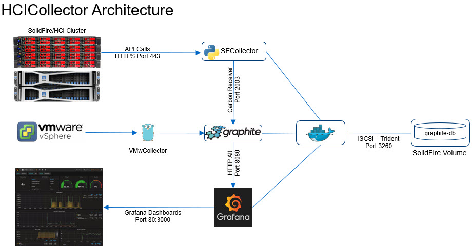

# HCICollector

The HCI Collector is a container-based metrics collection and graphing solution for NetApp HCI and SolidFire systems running Element OS v11.0 or newer.

## Changes

See [CHANGELOG.md](CHANGELOG.md).

## FAQs

See [FAQ.md](FAQ.md).

## Description

The HCICollector is a fully packaged metrics collection and graphing project for Element OS 11+ and vSphere 6+ clusters. It is based on the following components packaged as individual containers:

- sfcollector: container with SolidFire Python SDK. Runs a Python script that collects SolidFire storage cluster data and feeds it to GraphiteDB
- vmwcollector: vSphere stats collector. Collects vSphere data and feeds it to GraphiteDB
- graphite: database that stores received time series data
- grafana and grafana-renderer: graphing engine and a renderer with a Web UI that visualizes Graphite data through SolidFire and vSphere dashboards

HCICollector uses internal VM disk space, but advanced users can use [NetApp Trident](https://netapp-trident.readthedocs.io/) to store Graphite DB on a NetApp block or file storage system.

### Architecture and Demos



- [HCICollector walk-through for v0.7](https://youtu.be/wjie6niB2VE)
- [Demo of sfcollector using Element v11+ Volume Histograms](https://youtu.be/yggMCgSX2KM)
- [HCICollector walk-through for an older version](https://youtu.be/CNXgxkpActo)

## Prerequisites and requirements

HCICollector was tested with the following configuration (newer components might work):

- Ubuntu 18.04, Debian 10
- Docker CE v19.03.5 and docker-compose v1.26.0+
- NetApp HCI (SolidFire, Element OS) v11.3 (any v11 release or newer)
- VMware vSphere 6.7U3b or newer (other 6.x releases should work and so should vSphere 7 - see vsphere-graphite documentation)
- NetApp HCI storage and vCenter management accounts with read access to Element storage and vCenter API

Newer or older releases of each component may work. Element OS users with a pre-v11.0 software should check the FAQs.

HCICollector has the following minimum requirements:

- A recent Linux VM with Docker CE v19+
  - Disk capacity: approximately 10GB for OS, 3GB/hour for GraphiteDB in a small environment (see the FAQs or Graphite docs on how to use less storage)
- Read-only access to management API of SolidFire/Element v11 (Management IP or "MVIP") and vCenter. HCICollector can work with Element v10 and v11, but with v10 histogram metrics do not get collected and histogram panels won't work

## Installation and configuration

- Read the Security section below and make a plan based on your security requirements
- Deploy a VM with a sufficiently large disk (say, 1,000 GB) or adjust Graphite to retain less data by pruning it sooner
- Install Docker CE and docker-compose. Enable and restart Docker service
- Clone hcicollector repository (`git clone https://github.com/scaleoutsean/hcicollector`) or download the source code from Releases
- Execute the install script and provide requested inputs (`cd hcicollector; sudo ./install_hcicollector.sh`)
- Examine the config files and run `sudo docker-compose up` (recommended the first time as you can visually inspect everything works; stop it with CTRL+C) or `sudo docker-compose up -d` (background mode)
- Access Grafana at the VM port 80 (see under Security) and login with the temporary password from installation wizard. Default Grafana username is `admin`

### Example of install script questions & answers

- SolidFire management virtual IP (MVIP): 192.168.1.30
- SolidFire username (case sensitive): monitor (dedicated SolidFire cluster admin account created on SolidFire cluster)
- Password to use for the Grafana admin account: admin (temporary password until first log on)
- vCenter domain: local (IP-based VMware cluster)
- ESXi hostnames do not resolve in DNS: yes (no DNS - IPv4-based VMware cluster)
- IP address of this Docker host: "public" IP for Grafana access (the VM could have another network connected to Management LAN)
- Shell view:

```shell
 Enter the SolidFire management virtual IP (MVIP): 
192.168.1.30
 Enter the SolidFire username (e.g. 'monitor'): 
monitor
 Enter the Solidfire password: ******** 
 Enter the initial password to use for the Grafana admin account: *********
 Deploy read-only Grafana dashboards (no user customization) - 'true' or 'false'): 
false
 Enter the vCenter hostname or IP (e.g. 'vcsa' or '10.10.10.10'): 
192.168.1.7
 Enter the vCenter username: 
administrator@vsphere.local
 Enter the vCenter password: ********
 Enter the vCenter DNS domain (e.g. 'company.com' or 'local' if none)
local
 ESXi hostnames do not resolve in DNS - true or false? (e.g. 'true') 
true
```

### Update from previous release

I'd strongly recommend against it because there likely are small breaking changes in v0.7. Users of HCICollector v6 could just manually apply the dedupe formula fix from [v0.6.1](https://github.com/jedimt/hcicollector/compare/master...scaleoutsean:v0.6.1) branch, rebuild and restart. If you're happy with the way your HCICollector works, best don't touch it! Grafana pre-6.7.4 had a security issue with the avatar feature but HCICollector explicitly disables it (you may verify that in your `grafana/Dockerfile`).

If your SolidFire environment isn't large and you don't need the existing HCICollector data - you could stand up another instance of HCICollector and transition to it after it's working the way you want it, and then delete the old one.

But if you want to try, make a snapshot of the VM and then:

- Stop existing containers using docker-compose
- Take a snapshot of the VM and (if using Trident with external storage) the external volume used by GraphiteDB
- Delete existing containers with docker-compose. Consider updating Docker binaries
- Backup HCICollector configuration files
- Clone the latest HCICollector release from Github releases section. Do not run installation wizard in order to retain existing configuration files
- Start containers with docker-compose; this should rebuild the containers and leave existing configuration files in their place

### Use stand-alone SolidFire collector script with existing Grafana and GraphiteDB

This is not new - it was possible before HCICollector existed - but should be done more often. Maybe you don't use VMware (Hyper-V and KVM users), maybe you have existing GraphiteDB, etc.

Should you want to send Element storage cluster metrics to your own project or existing Graphite environment, you may use `solidfire_graphite_collector.py` from this repo (`python3 solidfire_graphite_collector.py -h`). External dependencies include [SolidFire Python SDK](https://github.com/solidfire/solidfire-sdk-python). SolidFire Collector (sfcollector) should be able to run on any major OS that supports Python 3.

NetApp HCI storage (SolidFire) dashboards may then by added from this repo (you'd have to edit them to make sure metrics' root and layout matches your environment), or you can create your own dashboards from scratch. Users without VMware vCenter should see the FAQs for additional details.

## Accounts and Security

- Accounts
  - If you want to a better security, use a dedicated SolidFire cluster admin account with a Reporting-only role. Even the Reporting-only role has access to sensitive iformation (initiator and target passwords of your storage accounts), but at least it cannot make modifications to SolidFire cluster (it can `Get` and `List`).
  - It is recommended to create a dedicated vCenter "read-only" account for limited, read-only access by vpshere-graphite
  - Do not use SolidFire cluster or VMware vCenter passwords for Grafana Web UI authentication
- Configuration files
  - Configuration files contain plain text passwords to SolidFire storage and vSphere
- HCICollector VM
  - Ensure that only administrator-level staff has access to your HCICollector VM (set a complex password on the VM, access Grafana Web UI over HTTPS, etc.)
  - By default, Grafana's Web service runs at port 80 (not 443). See the FAQs on how to configure HTTPS. Use a unique username and password for Grafana
- Network
  - HCICollector container is configured to not validate TLS certificate of SolidFire Management IP (edit sfcollector to change that if your certificates are valid)
  - Grafana access in HCICollector defaults to HTTP. This can be changed (see in [FAQs](FAQ.md)), but at the very least do not use SolidFire cluster or vCenter cluster passwords for Grafana admin authentication
  - If Grafana will be accessed by non-admin users you should create a multi-homed VM (one public (Grafana) and one private (Management LAN) interface. NetApp HCI has two Management VLANs (vCenter and Storage).
  - Anyone can send data (or junk) to Graphite's receiver ports on HCICollectore using VM's interfaces. You may modify Carbon configuration file ([FAQs](FAQ.md) to make Graphite listen on a different interface (say, loopback) from Grafana, or run HCICollector on a Management Network, or use ufw/iptables to restrict access, etc.
- 3rd party containers
  - Upstream containers are not audited or regularly checked for vulnerabilities. Feel free to inspect them on your own

## Acknowledgments

- This would not have been possible without the prior work of Aaron Patten, cblomart, cbiebers, jmreicha and other contributors
- [solidfire-graphite-collector](https://github.com/cbiebers/solidfire-graphite-collector) - original SolidFire collector script
- Main 3rd party applications
  - [docker-graphite-statsd](https://github.com/graphite-project/docker-graphite-statsd) - GraphiteDB and StatsD container by [Graphite](https://graphiteapp.org/). Documentation can be found [here](https://graphite.readthedocs.io/en/latest/releases.html)
  - [vsphere-graphite](https://github.com/cblomart/vsphere-graphite) - VMware vSphere collector for GraphiteDB
  - [Grafana](https://grafana.com)

## License and Trademarks

- `solidfire_graphite_collector.py`, SolidFire-related dashboards and scripts are licensed under the Apache License, Version 2.0
- External, third party containers, scripts and applications may be licensed under their respective licenses
- NetApp, SolidFire, and the marks listed at www.netapp.com/TM are trademarks of NetApp, Inc. Other marks belong to their respective owners

